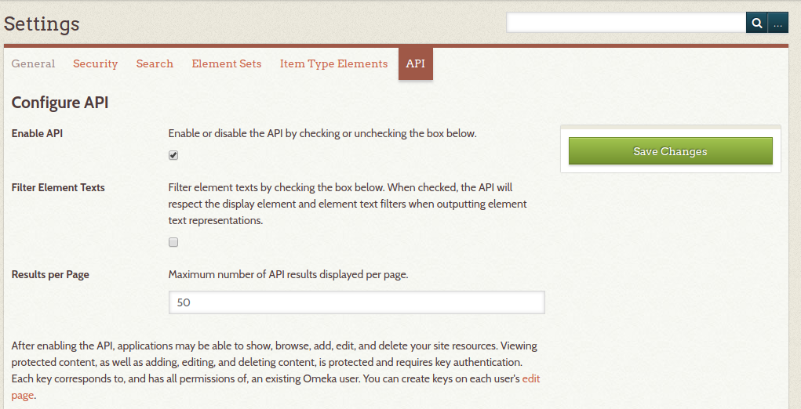
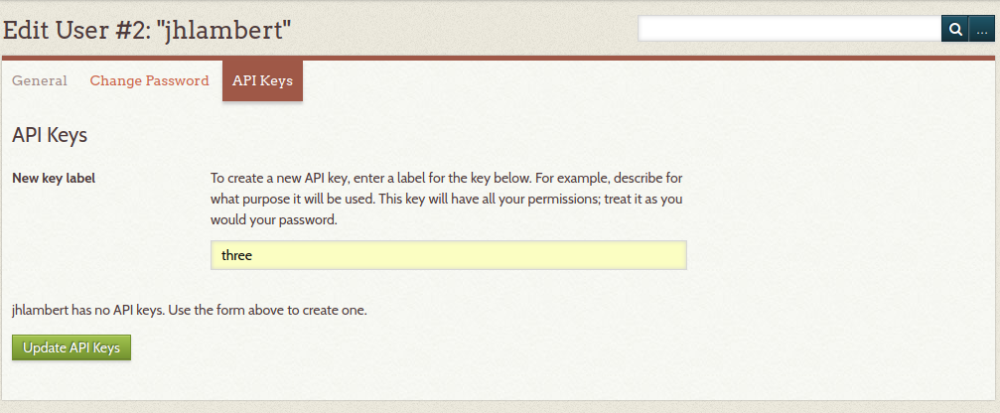
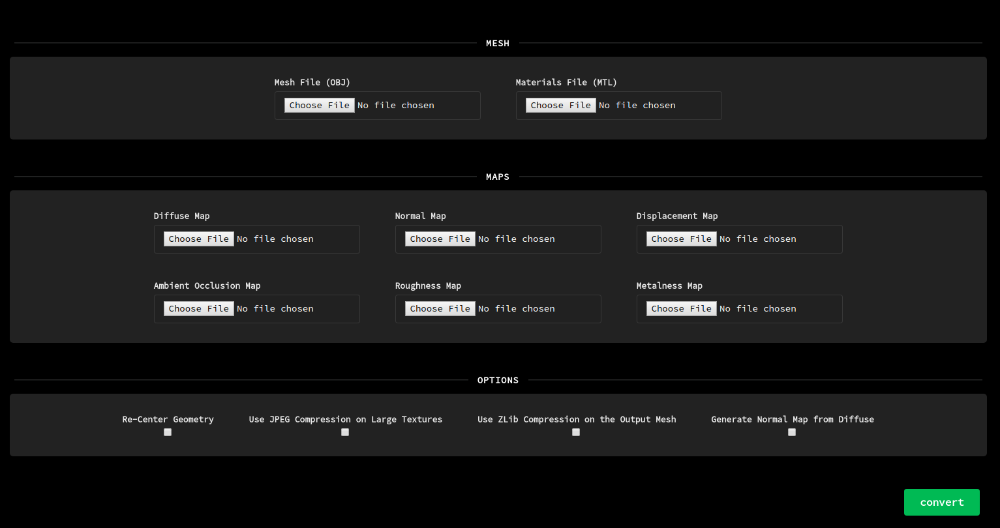
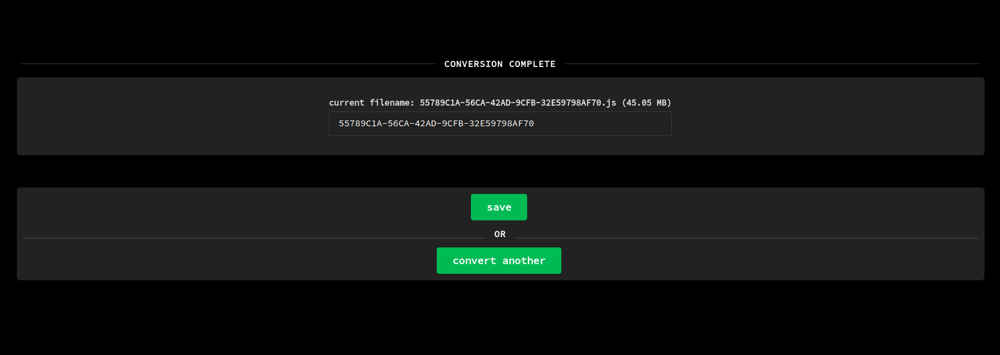
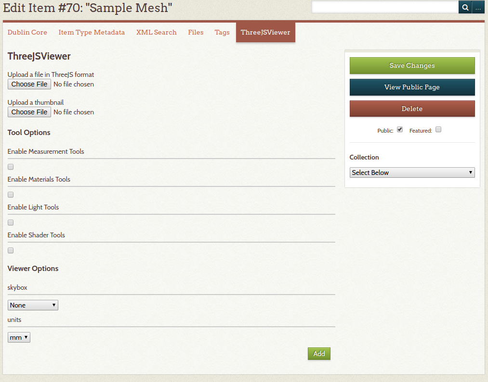
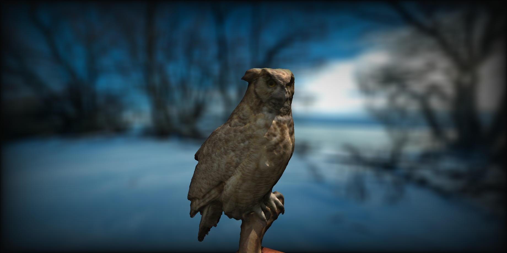
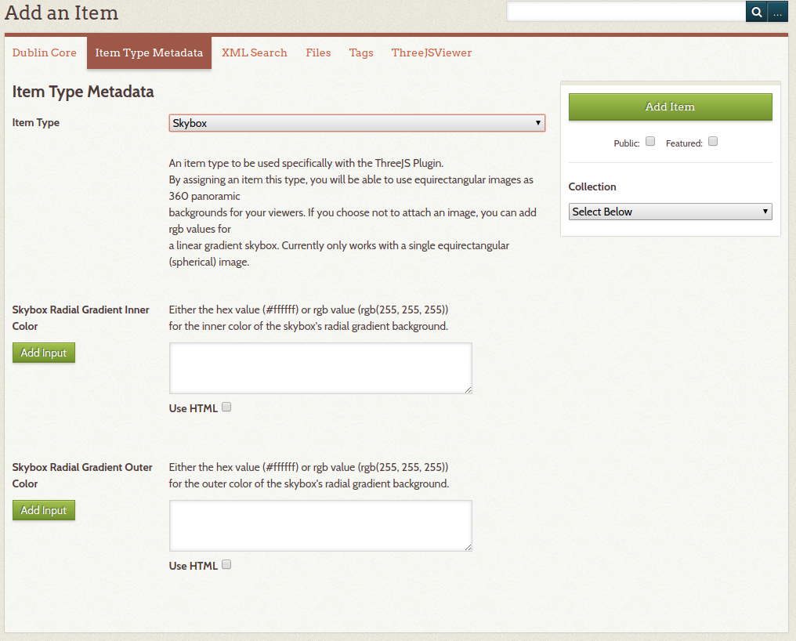

# Integrates a three.js Viewer Into Your Omeka Project
A 3D viewer geared towards cultural heritage collections. Includes tools for measurement, dynamic lighting, interactive shaders and materials settings.

Currently supports [OBJ + MTL](https://en.wikipedia.org/wiki/Wavefront_.obj_file) files and a variety of texture formats (see supported formats table), as well as [PTM](http://www.hpl.hp.com/research/ptm/downloads/PtmFormat12.pdf) files for projects doing [Reflectance Transformation Imaging](http://culturalheritageimaging.org/Technologies/RTI/). Support for more formats is planned for the future.

Still in active development.

## Installing the Plugin
Clone this repository into your plugins directory

`git clone https://github.com/rochester-rcl/plugin-ThreeJS.git ThreeJS`

or download one of the releases, unzip it to your plugins directory, and rename it to ThreeJS.

Install it like you would install any other Omeka plugin. To enable the API

## Configuring the Plugin

Once installation has completed, there will be a new link added to your site's public navigation called *Browse Meshes*, you can change the name of the link (or hide it) the same way you would for any other menu item.

There is currently only one global configuration option for the plugin, *Browse Template Description*, which provides a textbox so an optional description can be added to the top of the browse view.

This plugin uses the Omeka API. In order to use the plugin, the API must be enabled. To enable the API, select the API tab from the settings menu:

You will also have to generate API keys for any admin user who will be adding files to the system. To provide API credentials for a given user, edit the user from the *Users* tab on the admin bar. From there, select *API* keys and provide **"three"** as the label.

Finally, select *Update API Keys* and the user will now be able to upload models and save settings.

## Preparing the Meshes
To prepare a file for upload, you can use one of our conversion tools:

For [OBJ + MTL meshes](http://dslab.digitalscholar.rochester.edu/threejs-tools/converter)

For [PTM files](http://dslab.digitalscholar.rochester.edu/threejs-tools/ptm-converter)

The output of the conversion process is a single JSON file with all geometries, textures, and materials embedded. For more information see the [three.js wiki](https://github.com/mrdoob/three.js/wiki/JSON-Geometry-format-4).
##### NOTE
These are browser-based conversion tools, so performance is based on the machine they're being run on. Chrome is recommended. The conversion tools will also be bundled with the next release of the plugin once a few more features are added.

### Preparing Meshes

##### Mesh Converter Instructions

Mesh -- the mesh input files (OBJ and MTL)

Maps -- where you can upload all of your PBR maps. [Click here](https://threejs.org/docs/#api/en/materials/MeshStandardMaterial) for the full details on supported maps

### Mesh Converter Options

| Option                           | Description                                                                                                                       |
|----------------------------------|-----------------------------------------------------------------------------------------------------------------------------------|
| Re-Center Geometry (recommended) | Centers the model in the viewer                                                                                                   |
| Use JPEG Compression ...         | Any maps > 2048x2048 are transcoded to jpegs regardless of their original format                                                  |
| Use zlib Compression ...         | Compresses the mesh and texture data using the deflate algorithm. Results in a .gz file. If unchecked, the output is a JSON file  |
| Normal Map from Diffuse          | A normal map is estimated based on the horizontal and vertical gradients of the diffuse texture. Can help to add detail to simplified meshes |

Once you run the conversion (which may be quite slow depending on the options selected), you can modify the name of the output file and save it.

### PTM Converter Instructions

The PTM converter works pretty much the same as the above, with the exception of some post-processing options.

##### PTM Converter Options

| Option                           | Description                                                                                                                                                |
|----------------------------------|------------------------------------------------------------------------------------------------------------------------------------------------------------|
| Create Mesh from Surface Normals | Attempts to estimate depth from the surface normals extracted from the PTM. Produces a surface reconstruction as opposed to a flat plane. Results may vary |
| Use JPEG Compression ...         | Any maps > 2048x2048 are transcoded to jpegs regardless of their original format                                                                           |
| Use zlib Compression ...         | Compresses the mesh and texture data using the deflate algorithm. Results in a .gz file. If unchecked, the output is a JSON file                           |

##### NOTE
Some optimization attempts have been made with the conversion tools, and all processing is done in Web Workers wherever possible, but you may run into memory issues if you attempt to create normal maps from very large textures (>=8192x8192) on a below-average machine. Similarly, you may run into issues with very large PTM files (>300MB), and processing may take a few minutes.

## Adding a Mesh to an Omeka Item
Once you have converted your mesh, add a new item to your project. * The item must be saved before you can add a mesh to it. * Once the item has been saved, edit the item and navigate to the ThreeJSViewer tab.

From there, you can upload your converted file (.js or .gz extensions only), and select any relevant options.

##### ThreeJSViewer Options

| Option                   | Description                                                                                                                                                                                                                                                            |
|--------------------------|------------------------------------------------------------------------------------------------------------------------------------------------------------------------------------------------------------------------------------------------------------------------|
| Enable Measurement Tools | Allows users to take interactive measurements of the object. Note, the object must be properly scaled in order for this to work correctly. For more info, see the "Units" option below.                                                                                |
| Enable Materials Tools   | Allows users to manipulate various material properties including metalness, roughness, and normal scale.                                                                                                                                                               |
| Enable Light Tools       | Allows users to move a dynamic point light around the scene. In addition to xyz properties, they can also control the intensity and color of the point light.                                                                                                          |
| Enable Shader Tools      | Allows users to control custom shaders to aid in viewing the object. For now these include [Eye-Dome Lighting](https://blog.kitware.com/eye-dome-lighting-a-non-photorealistic-shading-technique/) and [Chroma Key](https://en.wikipedia.org/wiki/Chroma_key) shaders. |
| Skybox                   | Adds an optional skybox to the scene (see Creating Skyboxes for more details).                                                                                                                                                                                         |
| Units                    | The original unit of measurement the object was captured / scaled to. Please see the MeshLab tutorial ["Scaling to Real Measures"](https://www.youtube.com/watch?v=6psAppbOOXM) for more info.                                                                         |

Once you've selected all of your options, simply click the "Add" button and save your changes.

## Viewing your Meshes

The plugin adds three different routes to your Omeka site.

* *(my-site-url)/three-browse* - the path to the browse view, which shows all of the site's meshes. A link to this view is added to your site's navigation by default (you can turn it off in the plugin's configuration).

* *(my-site-url)/three/:id* - the path to view individual meshes. The *id* parameter is the id assigned by the plugin, not the item id.

* *(my-site-url)/three-embed/:id* - the path to an embeddable view that removes the site's header and footer.

## Other Featues

### Creating Skyboxes

To create a Skybox, begin by adding an item. Switch to the "Item Type Metadata" tab and select the "Skybox" item type from the dropdown.

There are currently two options for skyboxes:

* An image can be attached to the skybox item in the same way you add images to items. Currently, the plugin only supports single images with equirectangular (spherical) projection.

* If you prefer a skybox with a radial gradient you can enter the inner color and outer color (hex or rgb) as metadata fields. Note, if there's both a file and a gradient, files will always take precedence.

## Supported Formats

Mesh Import Formats (Conversion Tools Only)
- [x] OBJ / MTL
- [ ] FBX
- [ ] COLLADA
- [ ] STL
- [ ] PLY

Texture Import Formats
- [x] JPEG
- [x] PNG (RGB and RGBA)
- [x] TIFF (Not recommended)
- [x] WebP (Chrome and Edge)
- [ ] EXR
- [ ] DDS
